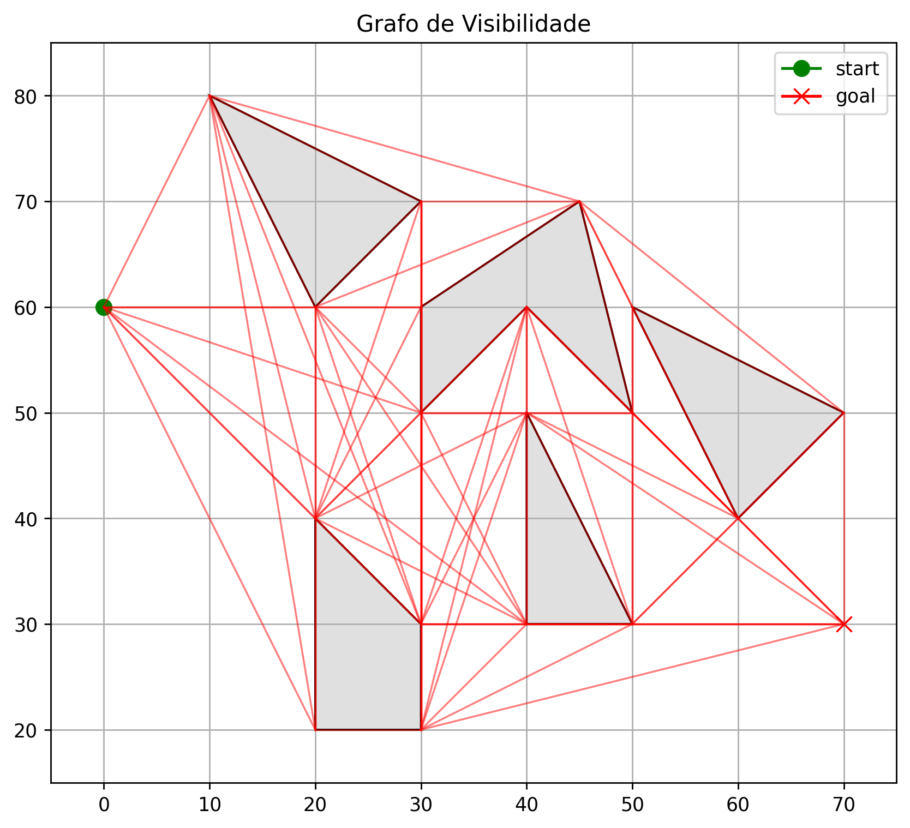
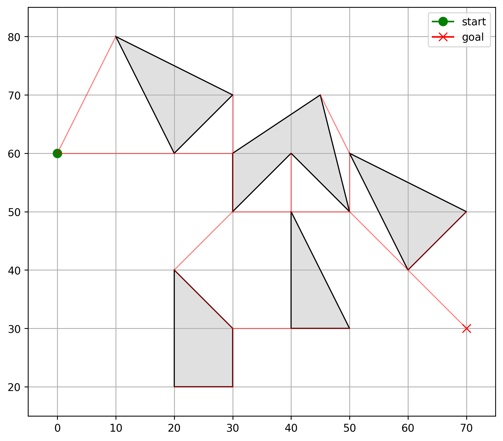
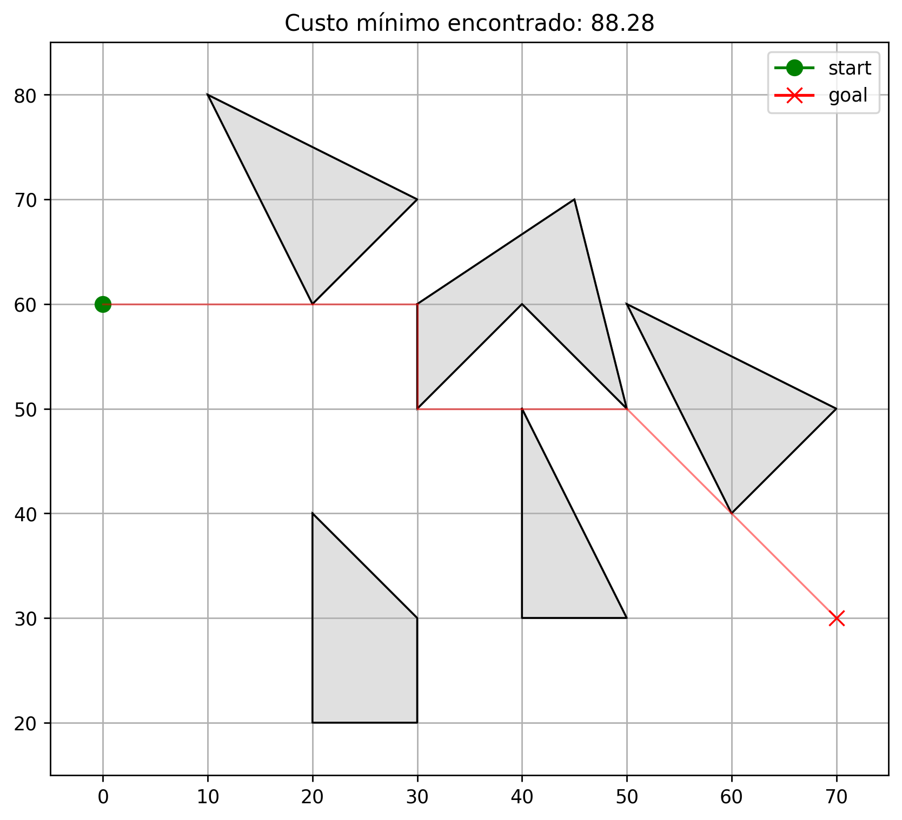

# Busca de Caminho com Grafos de Visibilidade e Árvores Geradoras Mínimas

## Visão Geral

Este projeto implementa um algoritmo de busca de caminho que combina grafos de visibilidade com o algoritmo de Árvore Geradora Mínima (AGM) de Kruskal e o algoritmo de caminho mais curto de Dijkstra. Encontra o caminho ótimo de um ponto inicial até um ponto objetivo, evitando obstáculos poligonais.

## Etapas do Algoritmo

### 1. Construção do Grafo de Visibilidade
Cria um grafo onde os vértices são o ponto inicial, o ponto objetivo e todos os vértices dos obstáculos. As arestas conectam vértices que têm linha de visão desobstruída.



### 2. Árvore Geradora Mínima (Algoritmo de Kruskal)
Reduz o grafo de visibilidade para sua árvore geradora mínima, mantendo apenas arestas essenciais enquanto preserva a conectividade.



### 3. Caminho Mais Curto (Algoritmo de Dijkstra)
Encontra o caminho de custo mínimo do início até o objetivo dentro da AGM usando o algoritmo de Dijkstra com fila de prioridade.



## Componentes Principais

- **Grafo de Visibilidade**: Conecta todos os pares de vértices visíveis
- **Union-Find**: Detecção eficiente de ciclos para o algoritmo de Kruskal
- **Algoritmo de Dijkstra**: Computa caminho mais curto com fila de prioridade
- **Visualização**: Renderização de caminho baseada em Matplotlib

## Formato de Entrada

```
inicio_x, inicio_y
objetivo_x, objetivo_y
numero_de_obstaculos
quantidade_vertices_1
vertice_1_x, vertice_1_y
...
```

## Saídas

- `plots/vis_graph.png` - Visualização do grafo de visibilidade
- `plots/mst_graph.png` - Árvore geradora mínima
- `plots/minimum_path.png` - Caminho ótimo final
- `data/grafo.json` - Estrutura do grafo
- `data/dijkstra_path.json` - Dados do caminho
